# Election_Analysis
## Overview of Election Audit
The purpose of this analysis was to audit the results of an election to produce an automated way of calculating the total vote count, percentage of votes for a candidate, and ultimately decide the winner. The dataset contained roughly 37000 rows that of data that pertained to the name of the candidate, the ballot id, and the county that the vote was cast. All of this data was collected from 3 counties in colorado and output to a CSV file. Through the use of a powerful coding language, we were able to automate a process that if done manual might take a ton of time.
  

## Election-Audit Results
* **How many votes were cast in this congressional election?**
  
The total number of votes that were cast in this election was 369,711, as seen below in the "Total Votes" snapshot. This was produced  by the code "Total Vote Counter" code snapshot. After initializing our total vote variable, and specifying how to open our csv within python (with open command and the csvreader dependicie) we used a for loop to iterate through our rows that contained the data. Because each row was one vote (as seen by the ballot number in the [Election Results csv](/Resources/election_results.csv)) we were able to have python take a look at 1 row, tick up our variable by 1 increment and move on, in this case, we did not need to specify an if cause, because the total number of votes is not specific to a particular candidate or county.

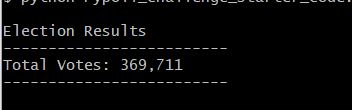
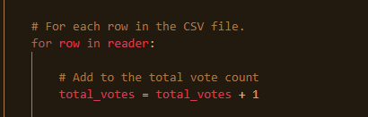

* **Provide a breakdown of the number of votes and the percentage of total votes for each county in the precinct.**
  
The number of votes per county and percentage  of county votes  can be seen in the image below under "County Votes". As we see in "County Votes" Denver had the largest turnout of voters at 82.8% with 306,055 votes, Jefferson had 10.5% of the votes with 38,855 and Arapahoe had 6.7% of the votes with 24,801 votes.
This was produced via another for loop in our python code. The for loop "For Loop 1" was used to iterate through each row and extract the second column, containing our county, into a variable named "county_name". These results were added to the previously created list "county_list". By using the if statement in the snapshot "County Code" we were able to add a voter ballot to a particular county, using both the "county_name" list and the "county_votes" dictionary. The code can be read in plain text as, " I see a new county, do I add it to my list? Yes. Let me count the number of votes for county A, and each time i see county A, i will tick up that county vote value." 
  
In order for us to calculate the number of votes per county, we needed to create a for loop that iterated through our county_votes dictionary. This can be seen in our "County Results" snapshot. By using the .get function we can grab the county name from the dictionary containing our votes. We then proceeded to calculate the percentage breakdown of the votes in the calculation in our for loop by dividing our county voter count by the total number of votes. Then we simply print the results to our command line.

    

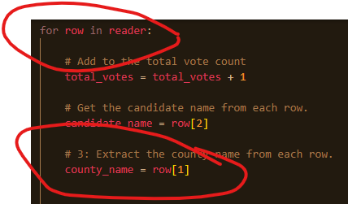
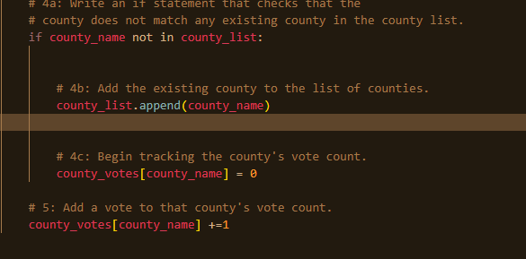
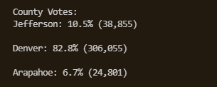
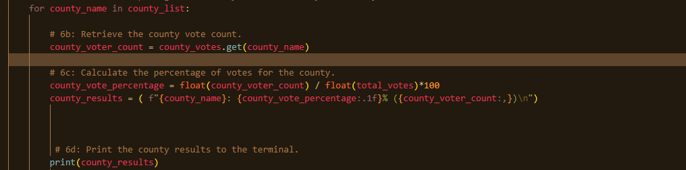

 

* **Which county had the largest number of votes?**
  
The county with the largest number of votes was Denver as seen by the "Largest County Turnout" snapshot. In order to determine the largest county we used the "Largest County Calculator"
if statement. Because the if statement is inside the for loop, it will iterate a number of times before it completes. In this case it will iterate for each county_name in the county_list dictionary, so 3 times. Then, the if statement will trigger for each county, replacing the value of total_county_votes and largest_county after each iteration.

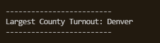
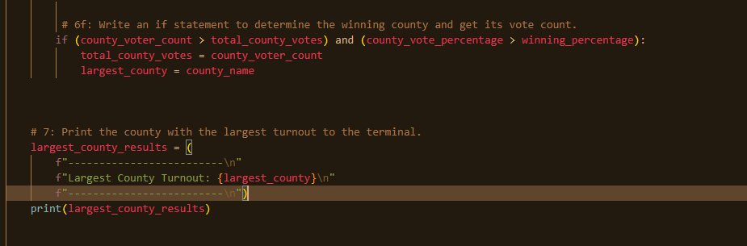

* **Provide a breakdown of the number of votes and the percentage of the total votes each candidate received.**
  
The number of votes and percentage of total votes for each candidate can be seen by the "Candidate Results" snapshot below. Based on these results we can see that Raymon had the least amount of votes with 3.1% which is roughly 11,606 votes, Diana had 73.8% of the votes and had 272,892 votes, and Charles had 23.0% of the votes and had 85,213 votes. 
The code behind these results functions very similarly to the county results. "Candidate Code" below we can see that yet again, a for loop is being used to iterate through a list, and adding the results to a dictionary. Then we are writing the results to a variable, in order to calculate the percentage. Because this is in the for loop, it will happen 3 times with each candidate, adding another ballet to appropriate candidate_votes dictionary for that candidate. 

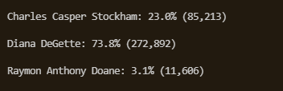
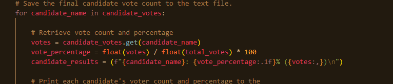

* **Which candidate won the election, what was their vote count, and what was their percentage of the total votes?**
  
The winning candidate was Diana DeGette, with a total vote count of 272,892 and a winning percentage of 73.8% as seen by the "Winning Candidate" snapshot. In order to calculate this, we used a nested if loop inside of our previous for loop above. The if statement "Winning Candidate Code" is used to determine the winner. It does this by assigning winning_count, winning_candidate, winning_percentage the value of the highest result in the for loop. Therefore, after iterating through our dictionary, we were able to come to the winner of Diana.

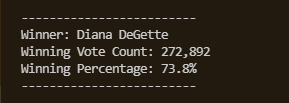
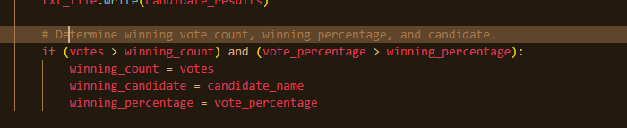

## Election-Audit Summary
  
The purpose of this script should be used to analyze any csv for a given number of counties. If the format of the ballots remain the same this code can still be used. Ballet ID being the first column, County being the second, and Candidate being the third. Any other alterations to the data will need to result in a code change, simply specify where 1. The county is, and 2, where the candidate is in the screenshot below known as "Alternate Code 1". If in the future more iformation is added, such as city, or zip code of the ballot, Specify what column index it is in the csv file and create another variable with said index such as "ballot_zip" = row[4] (the column index will be 1 less than the actual column because column 1 is 0 in our code.). We will also need to initailize a new dictionary and list for our zip codes. These will be used when we create a new if statement similar to "County Code" seen below, replacing the variables for our zip code related variables.
  
If we wanted to see how many votes a particular candidate got per county, to see where campaigns need to be focused more, we would need to add a line or two to our current for loop known as "County Candidate" here we circled what the new line might look like, calling for candidate names, as well as county names in a for loop that had stored values for our requested variables. 

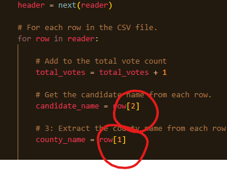

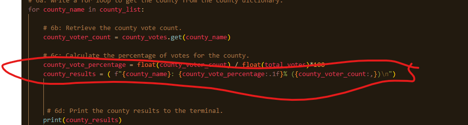

